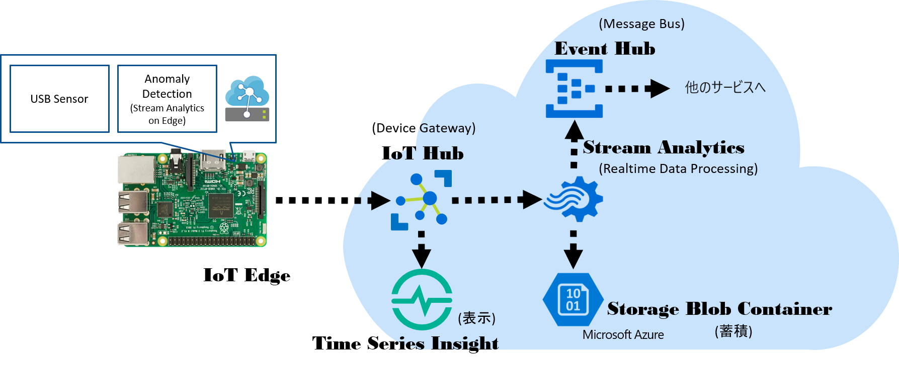

# IoT10MinutesCooking 
<b>IoT 10分間クッキング！</b>  
Microsoft Azure で IoT Solution の骨格を 10分でさっと作り上げる！  
※10分間は、あくまでも人が手を動かしている時間のみを計上します。流石にネットワークの遅延やクラウド側の諸々の処理を含めてしまうと、30分程度はかかるので。  

※接続するデバイスのセットアップは終わっている状態でやります。まぁ、Raspbianのインストールが終わっていればものの20分ぐらいでセットアップは終わりますけど。 

## 構築するソリューション構成 

※デバイス側の設定は、[https://docs.microsoft.com/ja-jp/azure/iot-edge/how-to-install-iot-edge-linux](https://docs.microsoft.com/ja-jp/azure/iot-edge/how-to-install-iot-edge-linux) と、[https://github.com/ms-iotkithol-jp/2jciebu-usb-raspberrypi/blob/master/DockerExtension/EXTEND_ja.md](https://github.com/ms-iotkithol-jp/2jciebu-usb-raspberrypi/blob/master/DockerExtension/EXTEND_ja.md) を参考にしてくださいませ。  

## 作業手順 
以下の順番で作業をしていきます。  
1. 作業用ダッシュボード作成 
2. リソースグループ作成 
3. IoT Hub の作成
4. デバイスの登録 
5. Time Series Insight 作成 
6. Blob Storage 作成 
7. Event Hub 作成
8. Stream Analytics 作成 

以下、それぞれのステップで行うことと関連する説明ドキュメントへのリンクを紹介していきます。  
### 1.、2. 作業用ダッシュボード作成とリソースグループ作成 
ソリューションを作っていくためのダッシュボードを作り、リソースグループを作成します。  
やりかたは、[Azure Portal ダッシュボードの使い方](https://github.com/ms-iotkithol-jp/IoTKitHoLV5/blob/master/docs/dashboard.md)を参照  

### 3. IoT Hubの作成 
基本は、[Azure Portalを使用してIoT Hubを作成](https://docs.microsoft.com/ja-jp/azure/iot-hub/iot-hub-create-through-portal)に書いてある通りに作成します。  
作業項目は、以下だけ  
- Marketplace で IoT Hubを探して作成ボタンをクリック
- IoT Hub の名前入力 
- 作成するIoT Hubの所属するリソースグループを選択 
- 作成ボタンクリック 

作成したIoT Hubがデプロイされたら、”組み込みのエンドポイント”の設定を開いて、コンシューマーグループに、”tsi"と”sa”という名前で追加します。 

### 4. デバイスの登録 
基本は、[デバイスを作成する](https://docs.microsoft.com/ja-jp/azure/iot-edge/how-to-register-device-portal#create-a-device)に書いてある内容を元に作業をします。
やることは、 
- Azure Portal上で、デバイスを”raspberrypi-usb"で登録 
- 接続文字列を、Raspberry Pi上のシェルで/etc/iotedge/config.yamlに書き込む 
- VS Code で、作成したIoT Hubを選択→デバイスを選択し、usb-sensor-moduleとanomaly-detectモジュールを配置
- IoT Edge Runtimeを再起動する 

です。センサーデータ収集やAnomaly Detection起動にはしばらくかかります。 送られたかどうかは、Device Explorerなどで確認してください。

### 5. Time Series Insight 作成 
詳細は、[Time Series Insightのドキュメント](https://docs.microsoft.com/ja-jp/azure/time-series-insights/)を見てください。やることは、 
- Marketplace で Time Series Insightを検索して作成をクリック 
- 名前を入力 
- 入力ソースを、前のステップで作成したIoT Hubを選択して入力ソースの名前を付け、先に作ったIoT Hubのtsiという名前のコンシューマーグループを選択して作成
- 計測時間のプロパティ名は、"measrued_time”と入力  
- 環境を開く 

既にIoT Edgeのモジュール群が動いていれば、なにがしかのグラフが表示されます。

### 6. Blob Storage 作成 
詳細は[Azure Storageの概要](https://docs.microsoft.com/ja-jp/azure/storage/common/storage-introduction)を見てください。やることは、
- MarketplaceでStorage Accountを検索
- 名前を付けて作成 
以上。 

### 7. Event Hub 作成 
詳細は、[Azure Event Hub概要](https://docs.microsoft.com/ja-jp/azure/event-hubs/)を読んでください。やることは、 
- MarketplaceでEvent Hubsを検索
- 名前空間の名前を入力 
- 価格レベルを選択（好きなレベルで） 
- 作成をクリック 

名前空間の配置が終わったら、
- Event Hubを”anomalydetect”という名前で作成
- 作成されたanomalydetectをクリックして、”共有アクセスポリシー”を選択し、送信権限を持つ、”sender”という名前のポリシーを作成

## 8. Stream Analytics 作成 

詳細は[Azure Stream Analytics 概要](https://docs.microsoft.com/ja-jp/azure/stream-analytics/stream-analytics-introduction)を見てください。やることは、
- Marketplace で Stream Analytics Jobを選択し作成
- 入力に”ストリーム入力の追加”で、IoT Hubを追加し、コンシューマーグループはsaを選択して、”device”という名前で追加
- 出力に”rawdata"という名前でBlobストレージを追加する。この際、新しく"rawdata"という名前でBlob Storageにコンテナを作成する
- 出力に"anomalydetect”という名前で、前のステップで作成したEvent Hubを追加する。接続ポリシーは、senderを選択する
- クエリーに、[ここ](https://github.com/ms-iotkithol-jp/2jciebu-usb-raspberrypi/blob/master/DockerExtension/EXTEND_ja.md#さらにおまけ)で公開されたスクリプトをコピペして保存する
- ”開始”をクリック 

Done! 

以上で、作業完了。実際にデータが保存されているかとか、異常状態の時だけEvent Hubにデータが送信されているかは、Storage ExplorerやService Bus Explorerを使って確認してみてくださいね。 

## 最後に 
実際には、以上の作業を完遂するにはクラウド側の処理なども含めて1時間程度はかかるかも、だし、10分でできたから何？って話もあるんですが・・・
この一連の作業でデバイスをきちんと管理された状態でセキュアにつないでテレメトリーデータの収集やデバイスへのメッセージ送信、送られたテレメトリーデータの生データの蓄積と他者への権限付きグラフ表示ダッシュボードの共有、送られてきた膨大なテレメトリーデータからの異常状態検出とセキュアに接続された別サービスへの検出イベント通知が可能なベースラインができる（たった1時間弱で）ので、更には接続デバイスが数千万台まで増えても対応可能なスケーラビリティと各サービスのモニタリング機能など、デバイス側にもDocker Imageをリモートでデプロイできたり、もっと省リソースのHWをリーフデバイスとして接続できたりというベースラインが出来上がります。
実運用システムは機能を作るのも重要だけれども、セキュアに管理された状態でちゃんと動くシステムを継続して運用する部分はとても大変なのでそこは既にあるものを使って、ビジネス上で本当にやりたい事にフォーカスしてもらえればと思います。

